## 本项目完整源码是收费的  接毕业设计和论文

### 作者微信：grapro666 QQ：3642795578 (支持部署调试、支持代做毕设)

### 接javaweb、python、小程序、H5、APP、各种管理系统、单片机、嵌入式等开发

### 选题+开题报告+任务书+程序定制+安装调试+论文+答辩ppt

**博客地址：
[https://blog.csdn.net/2303_76227485/article/details/148590508](https://blog.csdn.net/2303_76227485/article/details/148590508)**

**视频演示：
[https://www.bilibili.com/video/BV1HqTTzdEbg/](https://www.bilibili.com/video/BV1HqTTzdEbg/)**

**毕业设计所有选题地址：
[https://github.com/ynwynw/allProject](https://github.com/ynwynw/allProject)**

## 基于python+爬虫+html的豆瓣影视数据可视化系统(源代码+数据库+万字论文)226
## 一、系统介绍
### 1、用户：
- 注册、登录
- 首页统计：电影个数、豆瓣最高评分、出场最多演员、制片最多国家、电影种类饼状图、电影评分折线图、电影列表
- 历年电影产量统计、电影时长分布占比
- 电影评分折线图、电影星级占比图、年度评分柱状图、中外评分分布图
- 拍摄地点统计、电影语言统计
- 导演作品数量前20、演员参演电影数前20
- 词云图

## 二、所用技术
后端技术栈：
- python
- pandas
- Mysql
- 爬虫

前端技术栈：
- html
- javaScript
- css
- echarts

## 三、环境介绍
基础环境 :IDEA/pycharm, python3.11, Mysql5.7及以上, navicat

所有项目以及源代码本人均调试运行无问题 可支持远程调试运行

## 四、页面截图
文档截图:
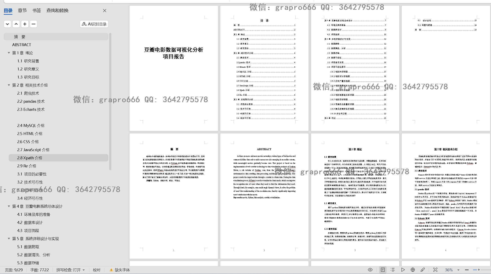
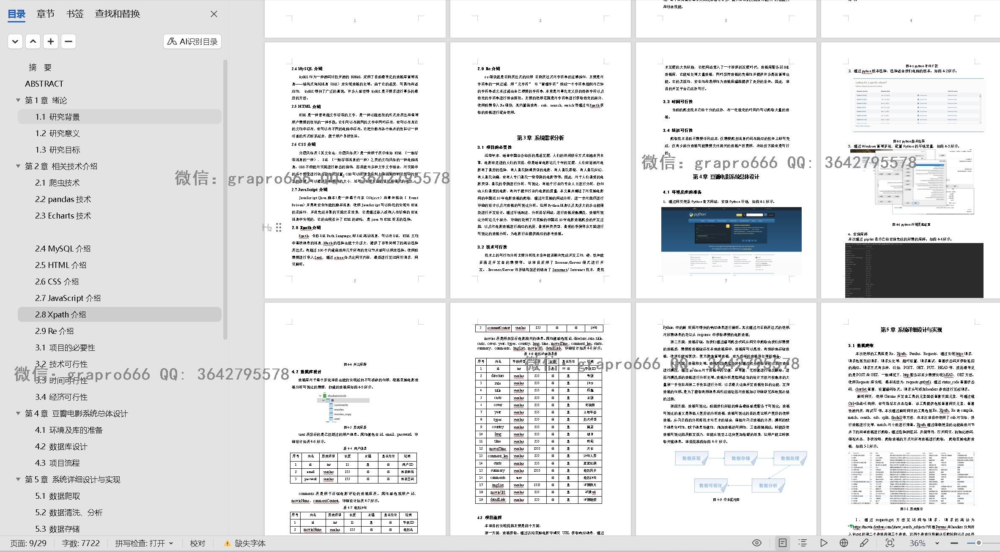
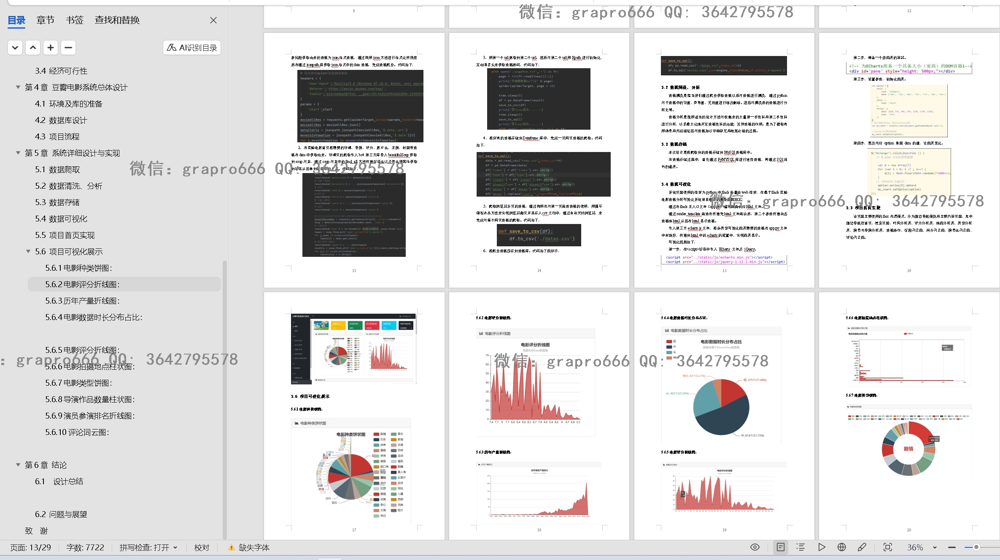
### 1、用户：
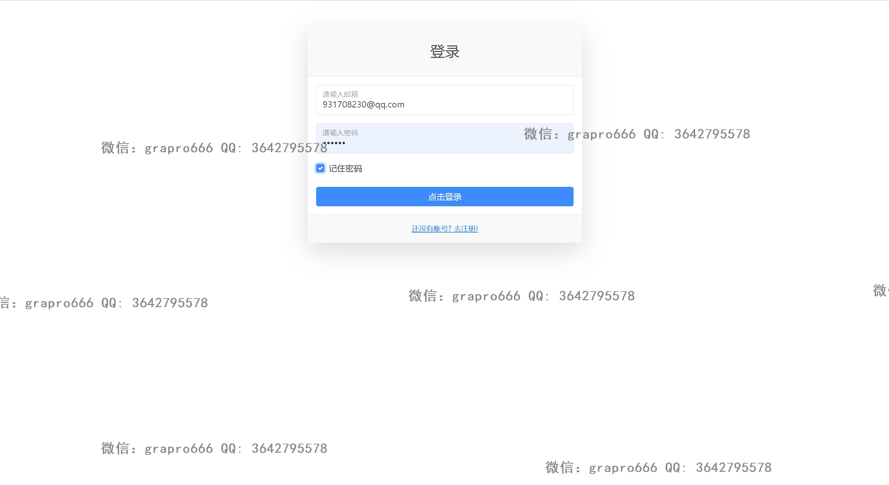
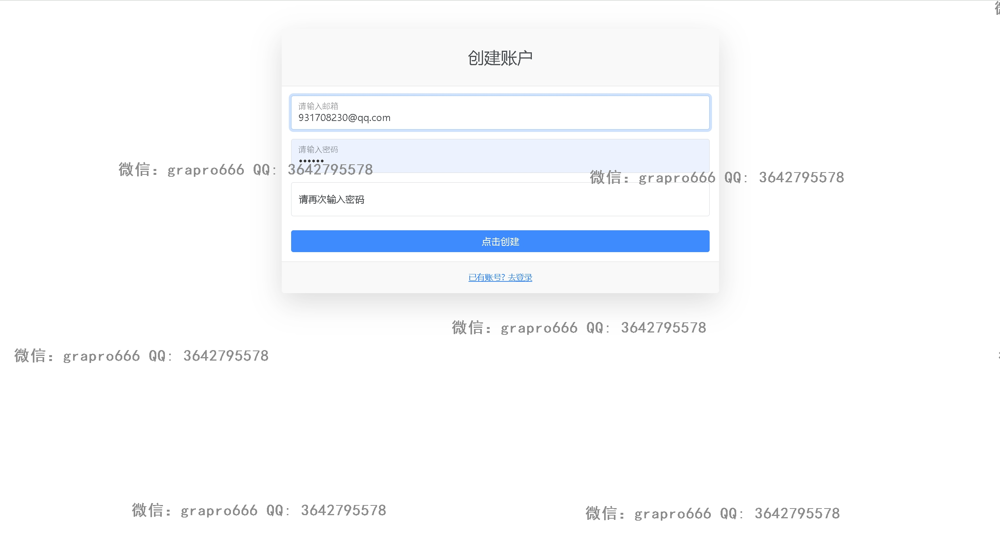
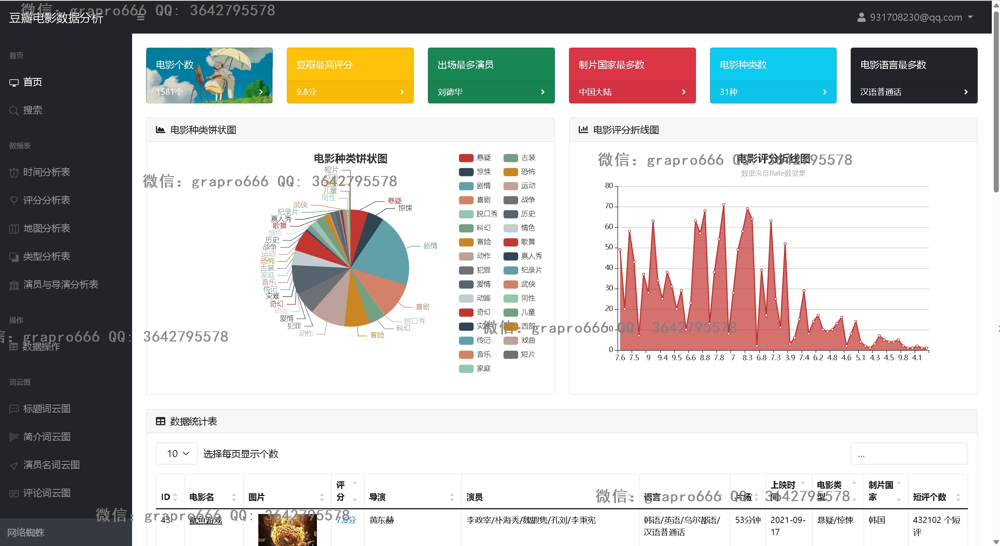

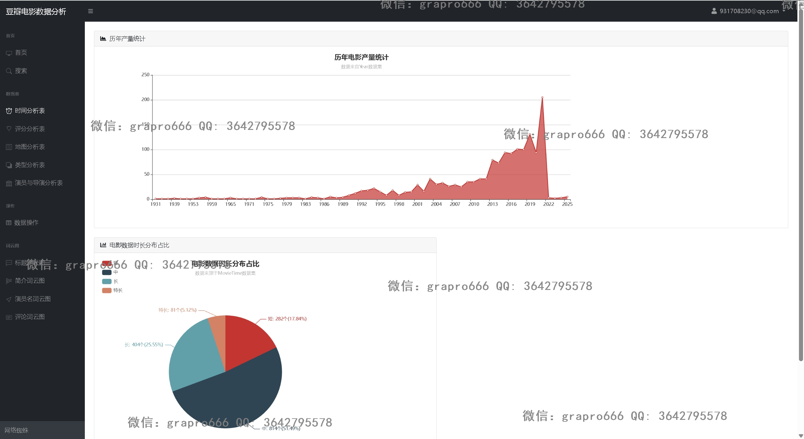
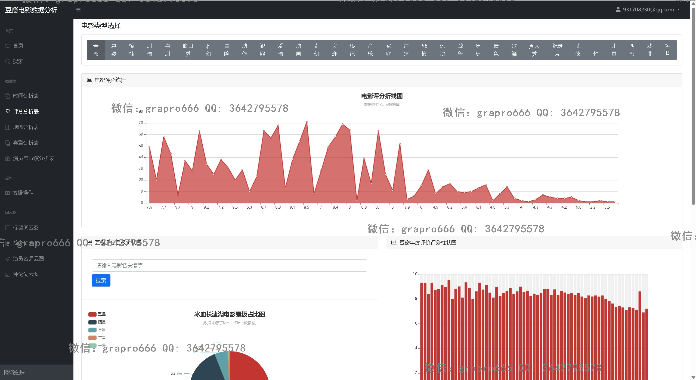
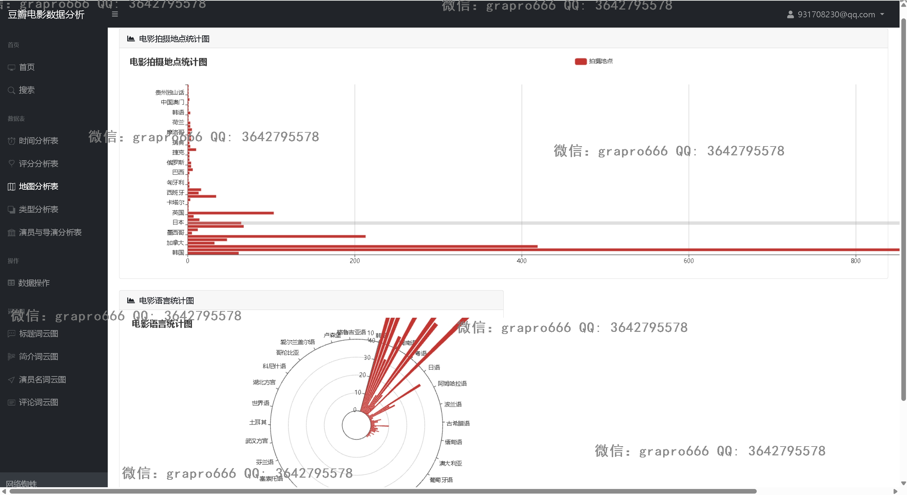
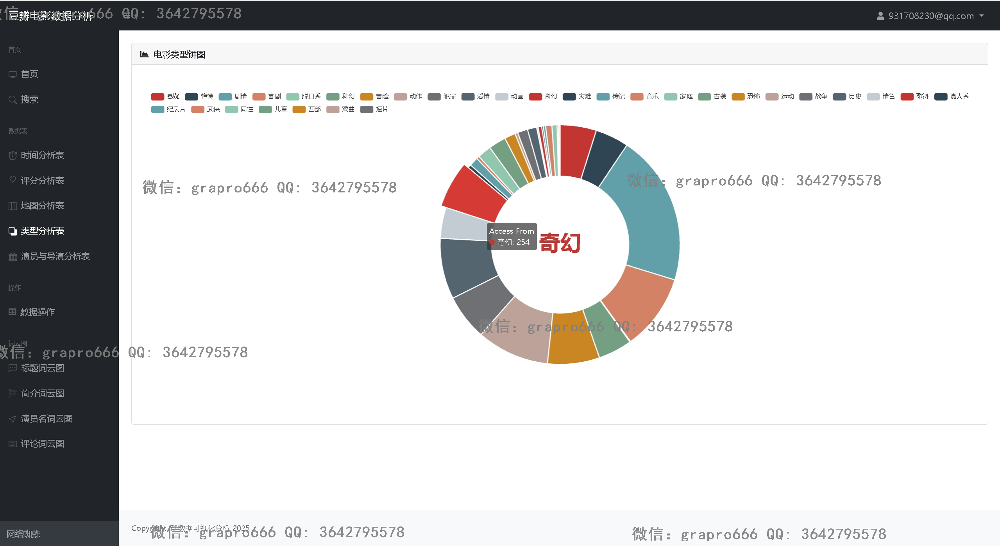
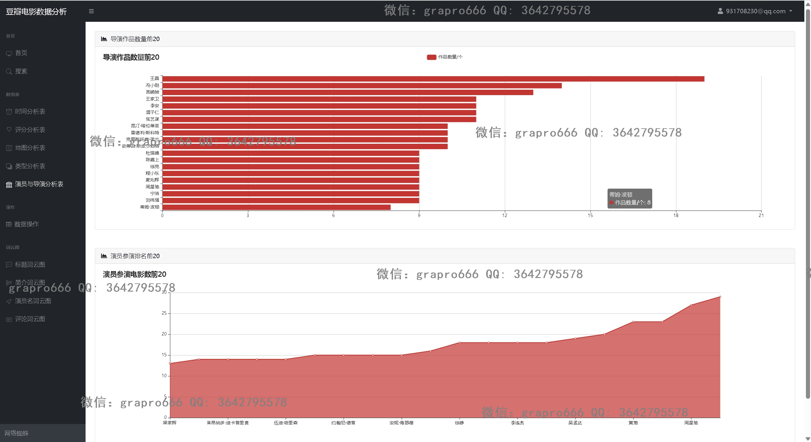
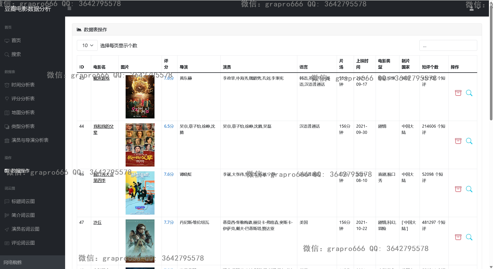

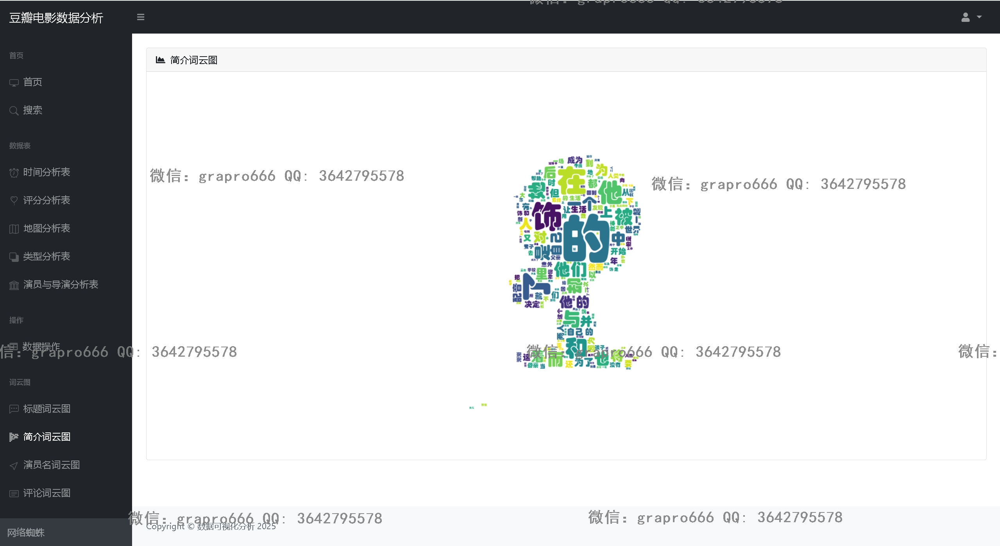
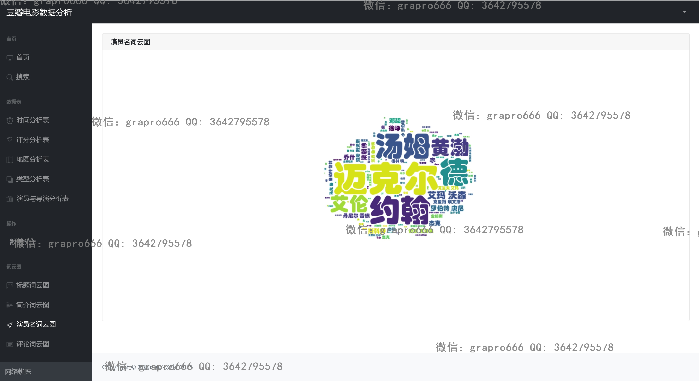
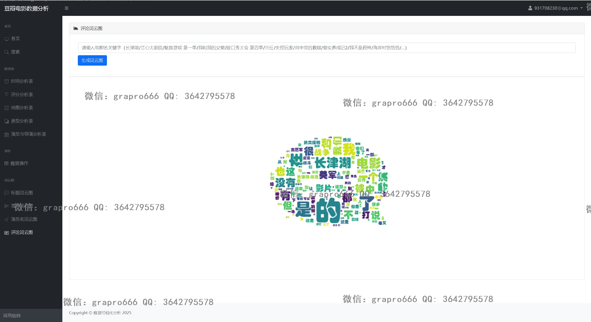
项目文件目录说明
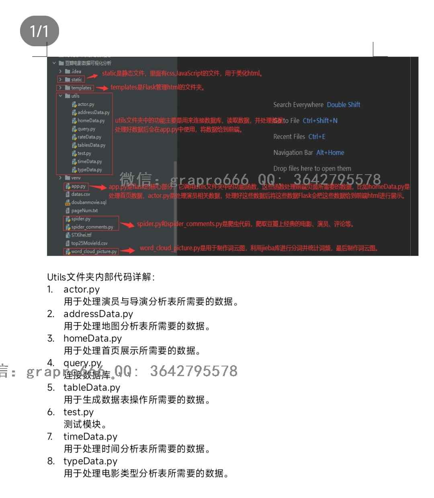

## 五、浏览地址
前台地址：http://localhost:5000

用户账户密码：931708230@qq.com/123456

## 六、部署教程
1. 使用Navicat或者其它工具，在mysql中创建对应名称的数据库，并执行项目的sql文件

2. 使用IDEA/PyCharm导入movie项目，File>setting>Project>Python interpreter配置虚拟环境

3. 修改项目里面的数据库配置

4. 打开终端执行pip install -r requirements.txt 

5. app.py启动项目
